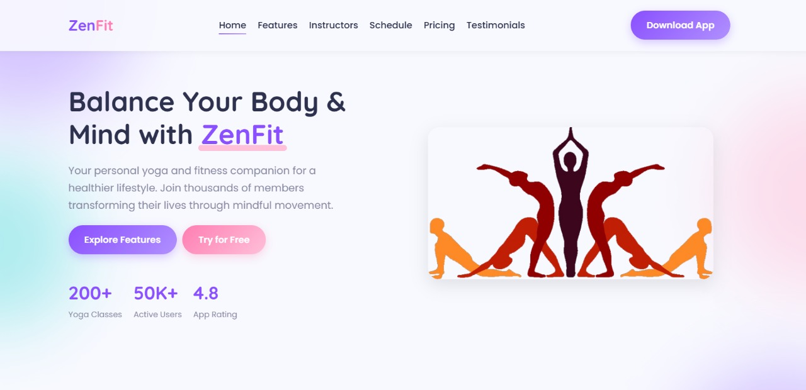
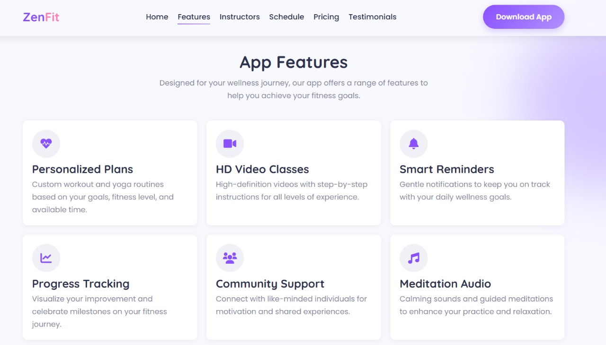
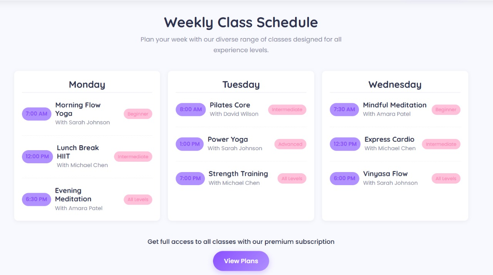
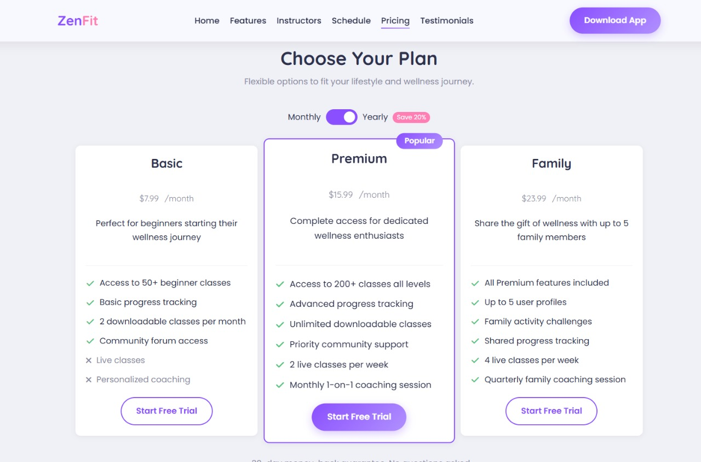
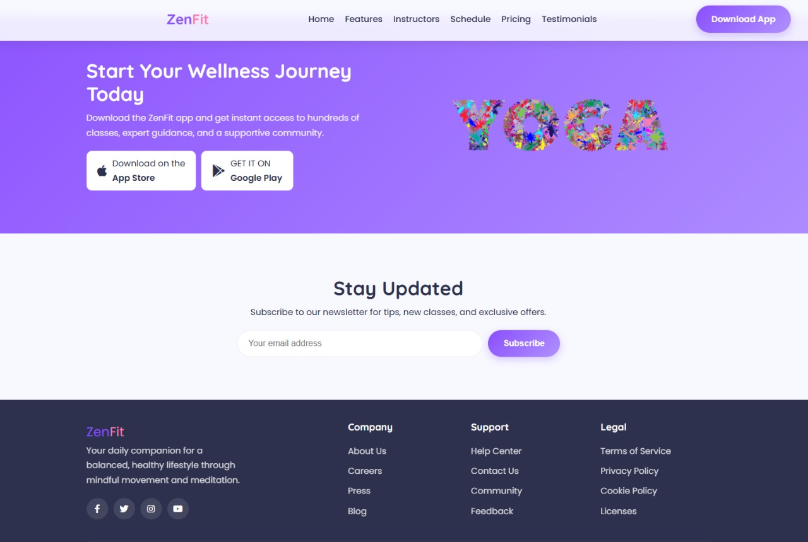

# 🧘‍♀️ ZenFit – Balance Your Body & Mind

**ZenFit** is a modern and responsive yoga and fitness web platform built to promote a healthier lifestyle through personalized yoga sessions, instructor scheduling, and fitness planning. Designed for mindful living, ZenFit makes wellness accessible for all.


## 🌐 Live Demo

🔗 [Visit ZenFit Website](https://priyankapinky2004.github.io/ZenFit/)

---

## 📌 Features

- ✨ Beautiful & calming UI with gradient themes
- 👩‍🏫 Instructor listings with availability
- 🗓️ Class schedule and booking interface
- 📱 Mobile responsive design
- 🧘‍♂️ Over 200+ yoga & fitness sessions
- ⭐ 4.8/5 app rating with 50K+ users (demo stats)

---

## 🖼️ Preview


 
 
 
 
 

---

## 🛠️ Tech Stack

| Category     | Tools Used            |
| ------------ | --------------------- |
| Frontend     | HTML, CSS, JavaScript |
| UI Framework | Tailwind CSS / Custom |
| Deployment   | GitHub Pages / Vercel |
| Design Tools | Figma / Canva         |

---

## 🚀 Getting Started

```bash
git clone https://github.com/priyankapinky2004/ZenFit.git
cd ZenFit
open index.html
```

## 🤝 Contribution

Contributions are welcome!

- Fork the repository

- Create a new branch (feature/your-feature)

- Commit your changes

- Push to the branch

- Open a pull request

📜 License
This project is licensed under the MIT License. See the LICENSE file for more info.

Made with ❤️ to promote health, fitness, and mindful living.
